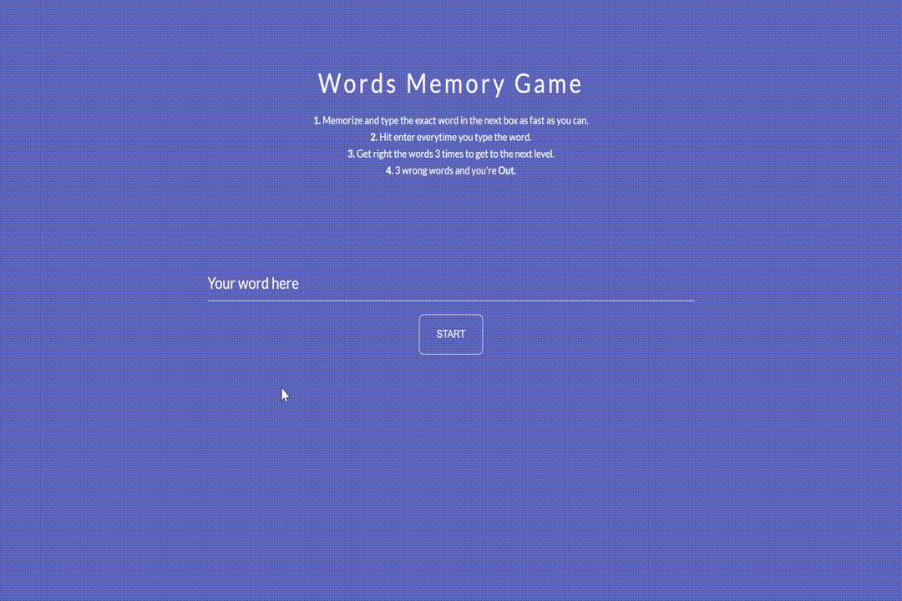
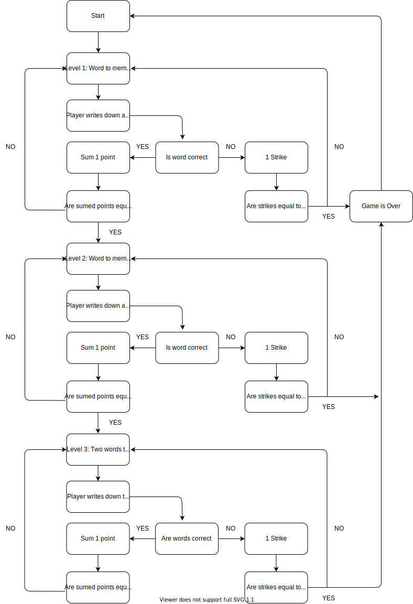

## Words Memory Game

* The game displays words to remember during few seconds. Then, when the words disappear, you have to fill in the field with the words that you can remember.
* This game was created using HTML, CSS And Vanilla JavaScript.

  

## Demo

Find the full demo here: 

  

## Built with

* HTML
* CSS
* JavaScript (Vanilla)

## How does it work?

## Developed with 💪 and ❤️ By:

[David Galeano](https://github.com/davidevOS) 
